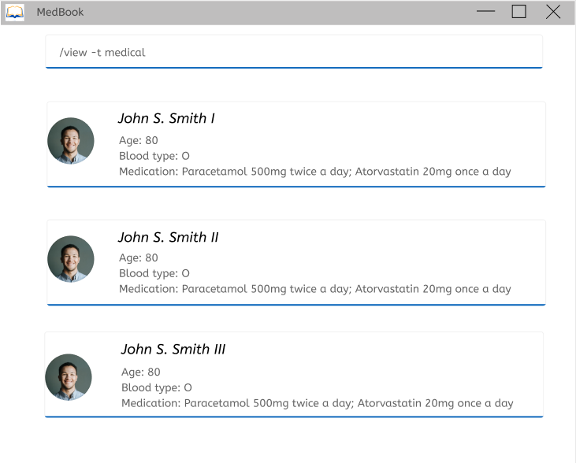

MedBook is a health monitoring system for healthcare professionals that simplifies tracking a patient’s medical details and scheduling appointments. MedBook delivers a seamless workflow for doctors and healthcare professionals to search for or update patients' medical information, billing and appointments through a simple and easy-to-use platform.

* The project simulates an ongoing software project for a desktop application (called _AddressBook_) used for managing contact details.
  * It is **written in OOP fashion**. It provides a **reasonably well-written** code base **bigger** (around 6 KLoC) than what students usually write in beginner-level SE modules, without being overwhelmingly big.
  * It comes with a **reasonable level of user and developer documentation**.
* For the detailed documentation of this project, see the **[Medbook Product Website](https://ay2122s2-cs2103t-t11-1.github.io/tp/)**.

### Acknowledgement
This project is based on the AddressBook-Level3 project created by the [SE-EDU initiative](https://se-education.org).